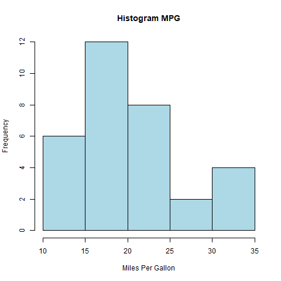
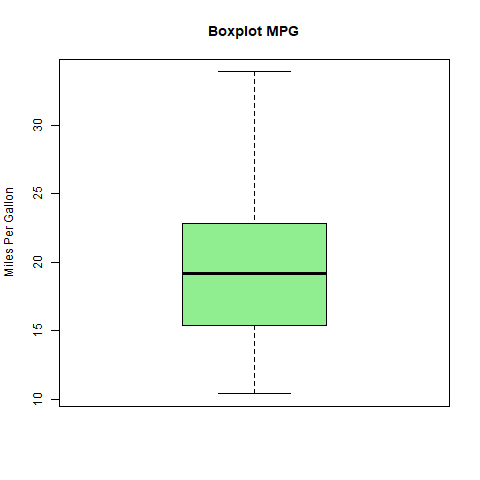
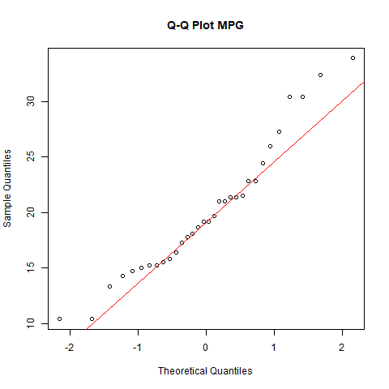
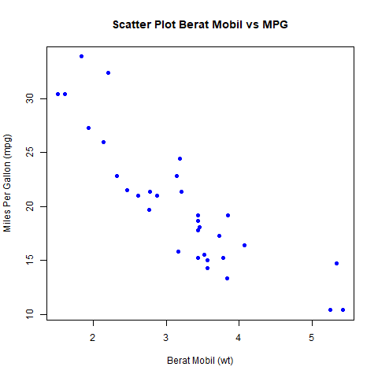
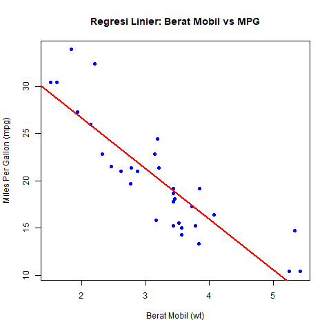

# Project Akhir Statistika dan Probabilitas

## Identitas
   - `Nama        :Gede Maha Pradipta Senjaya`
   - `Nim         :2515101001`
   - `Prodi       :Ilmu Komputer (S1)`

---

## Deskripsi Dataset
Dataset yang digunakan adalah `mtcars`, yaitu dataset bawaan R yang berisi data spesifikasi berbagai jenis mobil. 
Analisis difokuskan pada hubungan antara efisiensi bahan bakar (mpg) dan berat mobil (wt).

---

## Struktur Project
Struktur folder project adalah sebagai berikut:

```text
project-akhir-statpro/
├── data/
│   └── mtcars.csv
├── scripts/
│   ├── 01_deskriptif.R
│   ├── 02_normalitas.R
│   ├── 03_korelasi.R
│   └── 04_regresi.R
├── results/
│   ├── histogram_mpg.png
│   ├── boxplot_mpg.png
│   ├── qqplot_mpg.png
│   ├── scatter_wt_mpg.png
│   └── regresi_wt_mpg.png
└── README.md
```

## Cara Menjalankan Project
1. Pastikan R dan RStudio telah terinstal.
2. Buka project melalui RStudio.
3. Jalankan script secara berurutan:
   - `01_deskriptif.R`
   - `02_normalitas.R`
   - `03_korelasi.R`
   - `04_regresi.R`
4. Hasil analisis dan grafik akan tersimpan pada folder `results`.

---

## Hasil dan Interpretasi

### Statistik Deskriptif
**Output:**
- Histogram distribusi mpg
- Boxplot mpg
  



**Interpretasi:**
- Mean dan median menggambarkan nilai pusat mpg.
- Standar deviasi, range, dan kuartil menunjukkan variasi data.
- Modus tidak ditentukan karena data numerik kontinu.

### Uji Normalitas
**Output:**
- Q–Q plot distribusi mpg



**Interpretasi:**
- Berdasarkan uji Shapiro–Wilk dan Q–Q plot, data efisiensi bahan bakar (mpg) berdistribusi normal.
  
### Analisis Korelasi
**Output:**
- Scatter plot hubungan antara berat kendaraan (wt) dan efisiensi bahan bakar (mpg)



**Interpretasi:**
- Terdapat hubungan negatif yang kuat antara berat kendaraan (wt) dan efisiensi bahan bakar (mpg).
  
### Regresi Linier
**Output:**
- Scatter plot dengan garis regresi antara wt dan mpg



**Interpretasi:**
- Model regresi linier sederhana menunjukkan hubungan antara berat kendaraan (wt) dan efisiensi bahan bakar (mpg).
- Koefisien regresi bernilai negatif, yang berarti setiap kenaikan berat kendaraan akan menurunkan efisiensi bahan bakar.
- Nilai R-squared menunjukkan bahwa model regresi cukup baik dalam menjelaskan variasi efisiensi bahan bakar.

---

## Kesimpulan
Berdasarkan hasil analisis, dapat disimpulkan bahwa berat mobil memiliki pengaruh yang signifikan terhadap efisiensi bahan bakar. 
Project ini menunjukkan penerapan analisis statistik dasar menggunakan bahasa pemrograman R secara terstruktur dan reproducible.


